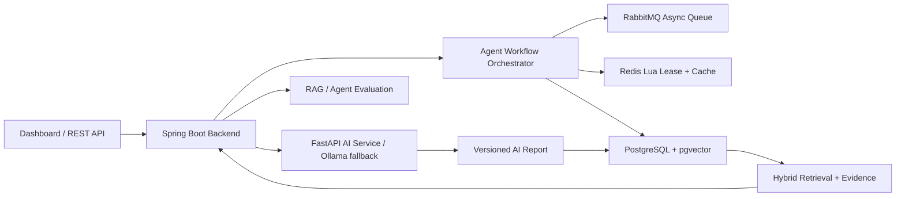

# FinSight AI

[English](README.md) | [简体中文](README.zh-CN.md)


FinSight 是一个面向股票投研场景的开源 AI Agent 后端平台，核心能力包括：证据驱动的 AI 研报、可恢复 Agent 工作流、Redis Lua Single-flight 并发控制、PostgreSQL/pgvector 混合检索、报告版本化缓存和 RAG 评测。

这个项目不是简单的“调大模型接口” Demo，而是重点展示 AI Agent 背后的后端工程能力：长链路任务治理、幂等调度、失败恢复、可信缓存、证据追踪和输出质量评测。

## 前端产品展示

FinSight 自带一个可运行的机构投研控制台。这个前端不是简单装饰页，而是把后端生成的投研工作流、报告缓存、证据链、RAG 评测和财务风险信号都展示出来。

### 投研工作台


- 支持输入股票代码，集中查看行情状态、价格走势、均线、成交量和 AI 投研结论。
- 行情历史优先使用真实市场 K 线，离线或接口不可用时使用确定性 fallback 数据，方便面试和本地演示。
- AI Brief 会输出评级、置信度、核心理由和风险点，而不是只返回一段不可追踪的聊天文本。

### Agent 工作流与可信报告


- 页面直接展示 Research Task 状态机：创建、采集、指标计算、索引、画像、研报生成和完成。
- 每个任务暴露幂等 key、attempts、lease owner、fencing token 等字段，让并发控制和任务治理能力可以被看见。
- Report Trace 展示 `reportVersion`、`dataSnapshotHash`、缓存命中、模型来源、生成时间，以及与报告结论绑定的证据 chunk。

### 指标、风险与证据链


- 将财务指标沉淀成投研视角的健康卡片，包括盈利能力、成长能力、现金流质量和资产负债率。
- 证据检索会返回来自公告、财报和结构化财务摘要的可追溯片段。
- 同一套证据层支撑 RAG 回答、报告引用、幻觉风险检测和评测回归用例。

## 为什么做这个项目

很多 RAG 项目停留在“检索几段文本，然后问 LLM”。FinSight 更关注一个 AI 投研系统真正落地时需要解决的问题：

- 长时间运行的 Agent 工作流需要明确状态机；
- 多实例环境下不能重复执行昂贵任务；
- AI 调用需要 Single-flight，避免请求放大和缓存击穿；
- AI 报告不能只按 prompt 缓存，而要绑定数据快照；
- RAG 回答必须能追踪证据来源；
- AI 输出质量需要可回归评测，而不是只靠主观感觉。

## 核心亮点

| 模块 | 实现内容 |
| --- | --- |
| Agent 工作流 | 将数据采集、指标重算、文档索引、公司画像、AI 研报生成拆成可恢复阶段 |
| 并发控制 | 幂等 key、repository 层 `createIfAbsent`、Redis Lua single-flight lease、fencing token、本地降级锁 |
| 失败恢复 | 任务状态机、阶段追踪、重试、Dead Letter、超时接管调度器 |
| 可信 AI 缓存 | `contextHash`、`dataSnapshotHash`、`reportVersion`，支持 Redis/PostgreSQL 缓存复用 |
| 检索链路 | PostgreSQL JSONB、全文检索、pgvector、混合召回、证据去重 |
| 评测体系 | RAG 命中率、证据覆盖率、答案覆盖率、幻觉风险、结论一致性、置信度校准、延迟 |
| Demo 展示 | Spring Boot API、静态 Dashboard、样例数据流、Actuator、Prometheus 指标 |

## 架构



更多设计细节见：[Architecture Notes](docs/architecture.md)

## 文档

- [Architecture Notes](docs/architecture.md)
- [Research API](docs/api.md)
- [Agent Workflow Design](docs/design-agent-workflow.md)
- [Benchmark And Evaluation Notes](docs/benchmark.md)
- [Resume And Interview Notes](docs/resume-and-interview.md)
- [GitHub Presentation Snippets](docs/github-profile.md)
- [Troubleshooting](docs/troubleshooting.md)
- [Roadmap](ROADMAP.md)
- [Contributing](CONTRIBUTING.md)

## 快速开始

### 0. 前置依赖

```bash
docker --version
docker compose version
```

- Docker Engine 和 Docker Compose v2，例如 Docker Desktop、OrbStack、Colima 或 Linux Docker daemon。
- 完整栈会同时运行 Elasticsearch、PostgreSQL、RabbitMQ、Redis、MinIO、Spring Boot backend 和 FastAPI sidecar，建议预留 8 GB 以上内存。
- 默认本地 Demo 不需要任何密钥。Ollama 是可选项；未安装或未运行时，AI sidecar 会返回确定性的规则分析。

可选的非 Docker 工具：

- Java 17 和 Maven 3.9+，用于 `cd backend && mvn spring-boot:run`。
- Python 3.12，用于直接运行 `ai-service`。
- Ollama 和 `qwen2.5:7b`，用于本地大模型分析。

### 1. 克隆并以后台服务启动完整栈

```bash
git clone https://github.com/juanjuandog/FinSight-AI ~/work/FinSight-AI
cd ~/work/FinSight-AI
docker compose up -d --build
```

这会以 detached 模式启动 backend、Dashboard、PostgreSQL/pgvector、RabbitMQ、Redis、FastAPI AI sidecar、Elasticsearch 和 MinIO。终端关闭后容器仍会继续运行。

检查状态并打开页面：

```bash
docker compose ps
curl -fsS http://localhost:8080/actuator/health
curl -fsS http://localhost:8001/health
open http://localhost:8080
```

服务管理命令：

```bash
docker compose logs -f backend
docker compose restart backend ai-service
docker compose stop
docker compose start
docker compose down
```

本地访问地址：

| 服务 | 地址 |
| --- | --- |
| Dashboard 和 Spring Boot API | `http://localhost:8080` |
| Backend health | `http://localhost:8080/actuator/health` |
| FastAPI AI sidecar health | `http://localhost:8001/health` |
| RabbitMQ management UI | `http://localhost:15672` |
| Elasticsearch | `http://localhost:9200` |
| MinIO API / console | `http://localhost:9000` / `http://localhost:9001` |

默认本地账号密码在 `docker-compose.yml` 中定义：PostgreSQL 和 RabbitMQ 为 `finsight` / `finsight`，MinIO 为 `finsight` / `finsight123`。

### 2. 运行 Demo 数据流

另开一个终端：

```bash
./scripts/quick-demo.sh
```

也可以分别运行小流程：

```bash
./scripts/demo-flow.sh
./scripts/demo-workflow.sh
```

常用接口：

```bash
GET  /api/workflows/summary
POST /api/evaluations/rag/run
GET  /api/companies/600519/ai-analysis/latest
GET  /api/document-index/600519/search?q=现金流风险
```

`./scripts/quick-demo.sh` 后的示例信号：

| 信号 | 示例结果 |
| --- | --- |
| Ingestion | `documentCount: 6`、`statementCount: 3` |
| Metric engine | `metricCount: 60`、`riskSignalCount: 2` |
| Evidence index | `600519` 有 `6 documents`、`6 chunks` |
| Intelligence graph | `20 events`、`36 entities`、`47 relations` |
| RAG evaluation | `totalCases: 3`，具体分数会随公开数据源变化 |

### 3. 不使用 Docker 运行

如果只想轻量体验本地后端，可以使用内存仓储：

```bash
cd backend
mvn spring-boot:run
open http://localhost:8080
```

## 模块结构

- `backend`：Spring Boot 后端，包含 API、领域工作流、指标计算、RAG 编排和 Dashboard。
- `ai-service`：FastAPI AI 能力服务，包含文档解析、实体抽取、embedding、rerank 和答案生成接口。
- `docker`：本地基础设施占位与 compose 支持。

## 运行模式

本地后端：

```bash
cd backend
mvn spring-boot:run
```

PostgreSQL profile：

```bash
docker compose up -d postgres
cd backend
mvn spring-boot:run -Dspring-boot.run.profiles=postgres,prod
```

PostgreSQL + RabbitMQ 工作流：

```bash
./scripts/run-backend-workflow.sh
```

生产近似完整栈：

```bash
./scripts/run-full-stack.sh
open http://localhost:8080
```

AI service：

```bash
cd ai-service
python -m venv .venv
source .venv/bin/activate
pip install -r requirements.txt
uvicorn app.main:app --reload --port 8001
```

可选 Ollama：

```bash
ollama serve
ollama pull qwen2.5:7b
```

如果 Ollama 未安装、未运行或模型缺失，系统会返回 `aiGenerated=false` 的规则兜底结果，Dashboard 仍然可用。

## 本地配置

默认 Docker Compose 配置不需要 `.env` 文件。只有需要替换本地基础设施或启用可选 LLM 行为时，才需要覆盖这些变量：

| 变量 | 默认值 | 用途 |
| --- | --- | --- |
| `OLLAMA_BASE_URL` | Docker 中为 `http://host.docker.internal:11434` | 可选本地 Ollama 地址 |
| `OLLAMA_MODEL` | `qwen2.5:7b` | 可选 Ollama 模型名 |
| `OLLAMA_TIMEOUT_SECONDS` | `45` | AI sidecar 调用 Ollama 的超时时间 |
| `FINSIGHT_SCHEDULER_ENABLED` | `false` | 是否启用股票池同步和批量分析调度 |
| `FINSIGHT_SCHEDULER_BATCH_LIMIT` | `20` | 调度批量任务上限 |
| `FINSIGHT_STOCK_UNIVERSE_FREE_PROVIDER_ENABLED` | `true` | 是否启用免费公开股票池数据源 |
| `FINSIGHT_AI_SERVICE_ENABLED` | Docker profile 中为 `true` | backend 是否调用 FastAPI sidecar |
| `SPRING_DATASOURCE_URL` | Docker 中为 `jdbc:postgresql://postgres:5432/finsight` | backend PostgreSQL 连接 |
| `SPRING_DATASOURCE_USERNAME` | `finsight` | backend PostgreSQL 用户名 |
| `SPRING_DATASOURCE_PASSWORD` | `finsight` | backend PostgreSQL 密码 |
| `SPRING_RABBITMQ_HOST` | Docker 中为 `rabbitmq` | backend RabbitMQ host |
| `SPRING_RABBITMQ_USERNAME` | `finsight` | backend RabbitMQ 用户名 |
| `SPRING_RABBITMQ_PASSWORD` | `finsight` | backend RabbitMQ 密码 |
| `SPRING_DATA_REDIS_URL` | Docker 中为 `redis://redis:6379` | backend Redis 连接 |
| `FINSIGHT_AI_SERVICE_URL` | Docker 中为 `http://ai-service:8001` | backend 到 sidecar 的 URL |

`scripts/quick-demo.sh` 还支持 `BASE_URL` 和 `OUTPUT_DIR`，分别用于指定 backend 地址和保存 JSON 响应。

### 常见问题

- Docker daemon 不可用：先启动 Docker Desktop、OrbStack、Colima 或 Linux Docker 服务，再运行 `docker compose ps`。
- 端口被占用：停止冲突服务，或修改 `docker-compose.yml` 中的宿主机端口。
- 首次构建较慢：第一次镜像构建会下载 Maven 和 Python 依赖，后续构建会复用 Docker cache。
- Ollama 不可用：不影响启动。`/health` 会显示配置的模型名，AI sidecar 在无法访问 Ollama 时会返回确定性兜底分析。

## 示例 API 流程

1. `POST /api/ingestion/demo` 初始化样例公司文档和财务报表。
2. `POST /api/metrics/recalculate/600519` 计算财务指标和风险信号。
3. `POST /api/analysis/ask` 提交证据驱动的投研问题。
4. `POST /api/document-index/{symbol}/rebuild` 重建文档证据块。
5. `POST /api/intelligence/{symbol}/rebuild` 构建时间线事件和轻量知识图谱。

异步工作流：

```bash
POST /api/ingestion/demo/async
GET /api/workflows
GET /api/document-index/600519/search?q=现金流风险
GET /api/metrics/600519/runs
GET /api/intelligence/600519/timeline
GET /api/intelligence/600519/graph
POST /api/evaluations/rag/run
```

## 数据库阶段

`postgres,prod` profiles 下由 Flyway 创建核心 schema：

- `companies`
- `financial_documents`
- `financial_statements`
- `financial_metrics`
- `risk_signals`
- `workflow_tasks`
- `company_events`
- `rag_traces`
- `stock_analysis_reports`
- `user_watchlists`

默认 profile 使用内存仓储，方便无 Docker 本地运行。

## 工作流阶段

FinSight 将长链路投研任务拆成任务生命周期和执行阶段：

- `WorkflowTask` 存储 idempotency key、status、agent stage、attempt count、payload、error message、lease owner、fencing token 和更新时间。
- `WorkflowTaskPublisher` 提供本地直连 publisher 和 RabbitMQ publisher 两种实现。
- `WorkflowOrchestrator` 基于 Redis Lua single-flight lease、幂等 key 和本地降级锁控制多实例重复执行。
- `WorkflowRecoveryScheduler` 扫描超时 `RUNNING` 任务，进行恢复、重试或 dead-letter。
- Agent stages 覆盖 ingestion、metrics、indexing、intelligence build、AI analysis、success、failure 和 recovery。
- `RabbitWorkflowListener` 消费消息，并在 RabbitMQ 拒绝消息时进入 dead-letter 队列。

运行：

```bash
./scripts/run-backend-workflow.sh
./scripts/demo-workflow.sh
```

## 检索阶段

检索层将金融文档切成可追溯 evidence chunk：

- `DocumentChunker` 对长文档做带 overlap 的切分，并保留 section metadata。
- `EmbeddingService` 本地使用确定性 384 维 embedding，也可调用 FastAPI sidecar `/embed`。
- `DocumentChunkRepository` 支持 keyword search、vector search 和 chunk replacement。
- PostgreSQL profile 使用 JSONB、全文索引和 pgvector cosine index。
- `HybridRetrievalGateway` 合并关键词和向量召回，去重后提供给 RAG。

接口：

```bash
POST /api/document-index/600519/rebuild
GET /api/document-index/600519/count
GET /api/document-index/600519/search?q=现金流风险
```

## 指标引擎阶段

指标引擎将硬编码 ratio 升级为可治理计算链路：

- `MetricDefinitionCatalog` 定义源指标、比率指标、同比指标和衍生 spread。
- `CoreFinancialMetricCalculator` 按财年顺序计算指标，并写入 plan version。
- `MetricCalculationRun` 记录每次计算的 statement count、metric count、risk count、时间戳和 metadata。
- `RiskRule` 组件检测现金流质量、应收压力、盈利能力趋势和杠杆风险。

接口：

```bash
GET /api/metrics/definitions
POST /api/metrics/recalculate/600519
GET /api/metrics/600519
GET /api/metrics/600519/risks
GET /api/metrics/600519/runs
```

## 公司画像阶段

公司画像阶段把文档和指标升级为公司状态建模：

- `CompanyIntelligenceService` 从公告、研报、指标和风险信号中抽取标准事件。
- `CompanyEventRepository` 存储按时间排序的公司 timeline。
- `KnowledgeGraphRepository` 存储轻量图谱实体和关系。
- 图谱实体包括 company、industry、document、product/keyword、financial metric 和 risk event。
- 图谱关系包括行业归属、文档发布、关键词提及、财务指标、风险信号和时间线事件。

接口：

```bash
POST /api/intelligence/600519/rebuild
GET /api/intelligence/600519/timeline
GET /api/intelligence/600519/graph
```

## Dashboard 与评测阶段

- Spring Boot 从 `/` 提供静态 Dashboard。
- Dashboard 展示 workflow task、metric output、retrieval evidence、timeline events、graph counts 和 evaluation results。
- `EvaluationCaseCatalog` 定义固定金融 QA 测试用例。
- `RagEvaluationService` 评测 RAG hit rate、evidence coverage、answer coverage、citation presence、hallucination risk、conclusion consistency、confidence calibration 和 latency。

接口：

```bash
GET /
GET /api/evaluations/rag/cases
POST /api/evaluations/rag/run
```

## Stock AI 阶段

- `StockUniverseService` 从免费公开数据源同步 5500+ A 股股票池，并支持 Eastmoney search 降级。
- `StockAnalysisApplicationService` 支持单股和批量分析任务提交。
- `StockAiAnalysisService` 将行情、指标、风险信号和 RAG 证据组装为 AI 分析上下文。
- AI 分析优先调用 FastAPI sidecar 和本地 Ollama，不可用时降级为确定性规则。
- `stock_analysis_reports` 存储 model/source metadata、citations、context hash、`data_snapshot_hash`、report version 和 generated time。
- `StockAnalysisCache` 提供内存和 Redis 两种实现；缓存 key 绑定 data snapshot，避免复用过期结论。
- `user_watchlists` 使用 `X-Finsight-User` header 提供用户级自选股基础能力。

接口：

```bash
POST /api/companies/sync-a-shares
POST /api/companies/batch-analysis
GET /api/companies/600519/ai-analysis
GET /api/companies/600519/ai-analysis/latest
GET /api/companies/600519/ai-analysis/history
GET /api/watchlist
POST /api/watchlist/600519
DELETE /api/watchlist/600519
```

## 工程化阶段

- Docker Compose 可启动 `backend`、`ai-service`、PostgreSQL/pgvector、RabbitMQ、Redis、Elasticsearch 和 MinIO。
- `postgres,rabbitmq,redis,prod` profiles 启用持久化仓储、Flyway、pgvector、Redis cache 和 RabbitMQ task dispatch。
- `RestAiServiceClient` 调用 FastAPI `/rerank` 和 `/generate-answer`，同时保留确定性本地 fallback。
- Workflow APIs 暴露 task list、task detail、status summary 和 failed/dead-letter manual retry。
- Spring Boot Actuator 暴露 `/actuator/health`、`/actuator/metrics` 和 `/actuator/prometheus`。
- 测试覆盖 deterministic embedding tests 和 PostgreSQL/pgvector + RabbitMQ Testcontainers smoke test。

接口：

```bash
GET /actuator/health
GET /actuator/prometheus
GET /api/workflows/summary
GET /api/workflows/{taskId}
POST /api/workflows/{taskId}/retry
```
